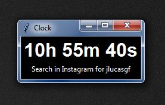

<h1>Clock with Python</h1>

clock made using python, based on the user's local time

<h3>Used tools</h3>
<table>
  <tr>
    <td>Threading</td>
    <td>Datetime</td>
    <td>PyInstaller</td>
  </tr>
</table>

<h3>Screenshot</h3>

<h3>Author</h3>
<a href="https://www.instagram.com/jlucasgf/?hl=pt-br">José Lucas Gonçalves Freitas</a> 
